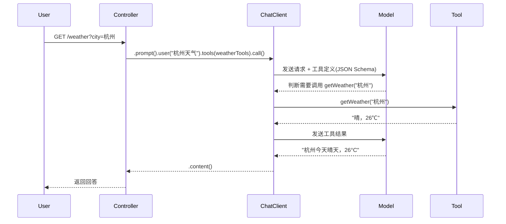

# 04 · 函数调用指南

> **前置 Demo**：demo01 ~ demo04（掌握 ChatClient 和提示词模板）  
> **涉及 Demo**：demo05、demo09、demo10  
> **目标**：掌握 `@Tool` 注解、ToolCallbackProvider 批量注册、参数校验的完整用法。

---

## 1. 什么是函数调用？

**函数调用（Function Calling / Tool Calling）** 让大模型在推理时"意识到"自己缺少某些实时数据，从而请求调用你提供的 Java 方法，拿到结果后再组织自然语言回答。

```
用户："杭州今天天气怎么样？"
        │
        ▼
模型判断：我需要天气数据 → 请求调用 getWeather("杭州")
        │
        ▼
Spring AI 自动调用 WeatherTools.getWeather("杭州") → "晴，26℃"
        │
        ▼
模型："杭州今天天气晴朗，气温 26℃，非常适合出行。"
```

---

## 2. @Tool 注解基础

`@Tool` 是 Spring AI 2.0 提供的核心注解，用于标记一个"可被模型调用的工具方法"。Spring AI 会自动把方法签名、参数、描述生成 JSON Schema 下发给模型。

### 2.1 基础示例（demo05）

```java
@Component
public class WeatherTools {

    private static final Map<String, String> WEATHER = Map.of(
            "杭州", "晴，26℃",
            "北京", "多云，22℃"
    );

    @Tool(description = "查询指定城市的当前天气，用于回答天气相关问题")
    public String getWeather(String city) {
        return WEATHER.getOrDefault(city, "对不起，暂无 " + city + " 的天气数据。");
    }
}
```

使用时只需 `.tools(...)`：

```java
@GetMapping("/weather")
public String weather(@RequestParam(defaultValue = "杭州") String city) {
    return chatClient.prompt()
            .user("请问 " + city + " 今天天气怎么样？")
            .tools(new WeatherTools())
            .call()
            .content();
}
```

### 2.2 `@Tool` 的关键属性

| 属性 | 说明 | 示例 |
|------|------|------|
| `description` | **最重要**：告诉模型"什么时候该用这个工具" | `"查询指定城市的当前天气"` |
| `name` | 工具的唯一标识（默认方法名） | 一般无需手动设置 |
| `returnDirect` | 工具结果是否直接返回给用户（不经过模型再组织） | 默认 false |

> **写好 `description` 是函数调用成功的关键**。描述越精确，模型越能准确判断何时调用。

---

## 3. 注入其他依赖的工具

工具类作为 Spring Bean 时，可以注入其他 Spring 管理的依赖（如 Service、Repository）：

```java
@Component
public class OrderTools {

    // 假设有一个 orderService 可以注入
    // private final OrderService orderService;

    @Tool(description = "根据订单号查询订单的最新状态")
    public String queryOrder(String orderId) {
        return ORDERS.getOrDefault(orderId, "未找到订单 " + orderId);
    }

    @Tool(description = "查询小店标准退换货规则")
    public String getRefundPolicy() {
        return "7 天内支持无理由退换...";
    }
}
```

方法签名非常灵活，Spring AI 会自动处理参数解析（基本类型、String、复杂对象均可）。

---

## 4. ToolCallbackProvider 批量注册（demo09）

当工具越来越多时，手动 `.tools(...)` 逐个添加很不优雅。`ToolCallbackProvider` 提供了集中化的批量注册方式。

### 4.1 核心用法

```java
public Demo09ToolCallingController(ChatClient.Builder chatClientBuilder, OrderTools orderTools) {
    // 方式一：把多个 Bean 打包成一个 Provider
    this.toolCallbackProvider = MethodToolCallbackProvider.builder()
            .toolObjects(orderTools)   // 可传多个 Bean
            .build();

    // 方式二：直接注册为默认工具，之后每次调用自动生效
    this.chatClient = chatClientBuilder
            .defaultToolCallbacks(this.toolCallbackProvider)
            .build();
}
```

### 4.2 优势

| 对比 | demo05（手动） | demo09（自动） |
|------|---------------|---------------|
| 注册方式 | 每次 `.tools(new Xxx())` | 构建时 `.defaultToolCallbacks(...)` |
| 新增工具 | 需要在每个控制器里加一行 | 新增 @Component Bean 即可 |
| 解耦程度 | 工具与控制器耦合 | 工具与控制器完全解耦 |
| 适用场景 | 临时、少量工具 | 生产环境、多工具 |

---

## 5. 多工具协同

当一个类里有多个 `@Tool` 方法，模型会根据用户意图自动选择调用哪一个：

```java
// demo09：两个工具方法共存
@Component
public class OrderTools {

    @Tool(description = "根据订单号查询订单的最新状态")
    public String queryOrder(String orderId) { ... }

    @Tool(description = "查询小店标准退换货规则，当用户问到能否退货时调用")
    public String getRefundPolicy() { ... }
}
```

当用户问"订单 A1001 到哪了"→ 自动调用 `queryOrder("A1001")`  
当用户问"咖啡能退吗"→ 自动调用 `getRefundPolicy()`

模型会根据 `description` 的描述**自动路由**到正确的工具。

---

## 6. 工具结果的组织方式

Spring AI 支持两种结果处理模式：

### 6.1 默认模式（模型再组织）
工具返回的结果会再次送给模型，模型基于它重新组织自然语言回答。适用于结果需要解释的场景。

### 6.2 returnDirect 模式
设置 `@Tool(returnDirect = true)` 时，工具结果直接返回给用户，不经过模型二次处理。适用于精确数据查询。

---

## 7. 函数调用的完整时序



---

## 8. 常见问题

| 问题 | 原因 | 解决 |
|------|------|------|
| 模型不调用工具 | `description` 太模糊 | 重新写描述，明确触发条件 |
| 总调用错误的工具 | 多个工具的 `description` 相似 | 在描述中增加区分性关键词 |
| 参数传错 | 方法参数名不够语义化 | 参数名应清晰表达含义（如 `city` 而非 `param1`） |
| 工具逻辑报错 | 异常未处理 | 工具内部应 try-catch，返回友好错误信息 |

---

## 下一步

了解函数调用后，看看如何组合多项能力构建智能体：[05 · Agent Skills 实战](./05-agent-skills-guide.md)。
